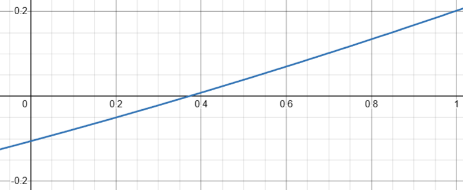

# MoralScale

This is a scale (0.00 - 1.00) used by every [Character](./Character.md)
which determines how "good" a character is AS SEEN BY SOCIETY

 - 75%-100% moral = "good" as seen by most of society
 - 25%-0%   moral = "bad"  as seen by most of society
 - 26%-74%  moral = "neutral"

### How a characters moral is changed:

 - Killing Characters -- TLDR: much easier to lose moral by killing
    - Basic Idea:
        - Victims with 100% moral: LOSE 20%  moral
        - Victims with 50%  moral: LOSE 5%  moral
        - Victims with 25%  moral: GAIN 5%  moral
        - Victims with 0%   moral: GAIN 10% moral

Close matching function representing amount lost:
`x` being the victims moral

`f(x) = 0.0363636x^2 + 0.270909x - 0.105455`

    

 - Completing main [Quests](./Quest.md) in certain ways